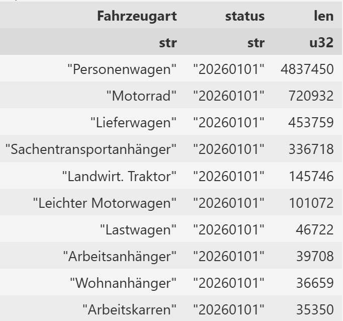

# Swiss Vehicle Data of ASTRA

ASTRA, the Swiss Federal Roads Office, provides rich data about vehicles in Switzerland. This repository contains code to download and process some of it, and make it available for analysis.

The main source is https://www.astra.admin.ch/astra/de/home/dokumentation/daten-informationsprodukte/fahrzeugdaten.html, which contains data about newly registered vehicles, as well as the total stock of vehicles in Switzerland. The original data comes as txt, and is updated regularly.

Check above link for available stati and datasets.

## Fetching the data

To save the data in the convenient Apache parquet format, we have code in both Python and R. The code can be adapted to fetch different datasets.

- **Python**: vehicles.ipynb
- **R**: vehicles.R (not yet available)

## Example screenshot of counts per `Fahrzeugart` (stock)

